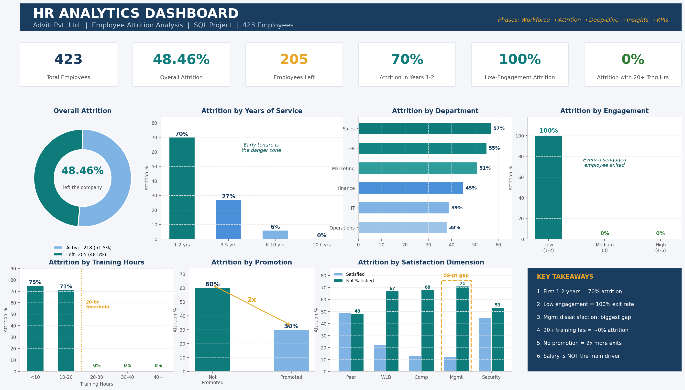

# 📊 HR Analytics — Employee Attrition Analysis (SQL)

**Analyzing why a consulting firm loses nearly 1 in 2 employees — and what can realistically fix it.**



---

## 📌 Project Overview

Adviti Pvt. Ltd. is a data-driven consulting firm facing a critical business problem: an overall employee attrition rate of **~48%** — roughly 3x above the healthy industry benchmark of 10–15%. High attrition drives up hiring costs, drains trained talent, and disrupts team productivity.

I was tasked (as the Data Analyst) with analyzing the company's HR dataset of **423 employees** to answer three questions:

1. **Where** is attrition concentrated?
2. **Why** is it happening?
3. **What** actions can realistically reduce it?

The entire analysis was performed in **MySQL** using a structured 5-phase approach, and delivered as a stakeholder-ready report with data tables, charts, insights, and a KPI framework.

---

## 🛠️ Tools & Skills

| Tool | Used For |
|------|----------|
| **MySQL** | Data cleaning, feature engineering, all 25 analysis queries |
| **MS Word** | Final consulting-style report with embedded charts |

**SQL concepts demonstrated:** `GROUP BY` aggregations · Window functions (`SUM(COUNT(*)) OVER()`) · `CASE WHEN` bucketing · Subqueries · `UNION ALL` multi-dimension analysis · `TIMESTAMPDIFF` date arithmetic · `IFNULL` / `NULLIF` defensive coding · `HAVING` group filters · Conditional aggregation (`SUM(Attrition = 'Yes')`)

---

## 📂 Repository Structure

```
├── project_sql.sql                      # Full SQL file: data cleaning + 25 queries (Phases 1–3)
├── HR_Analytics_Report.docx             # Final report: charts, tables, insights, recommendations, KPIs
├── HR_Analytics_Dashboard.png           # One-page visual summary of key results
├── HR_Analytics_Project_Brief.pdf       # Original project requirements
└── README.md
```

---

## 🔄 Analysis Approach — 5 Phases

| Phase | Question Answered | Deliverable |
|-------|-------------------|-------------|
| **1. Workforce Overview** | Who works here? | 11 queries — baseline across demographics, tenure, salary, training, engagement |
| **2. Attrition Distribution** | *Where* is attrition high? | 9 queries — attrition % across every key dimension |
| **3. Deep-Dive Analysis** | *Why* is it happening? | 5 cross-dimensional queries (e.g., Training × Promotion) |
| **4. Key Insights** | What does it mean for the business? | 8 plain-English findings with business implications |
| **5. Recommendations & KPIs** | What should leadership do? | 6 targeted recommendations + 15-KPI tracking framework |

---

## 🧹 Data Preparation Highlights

- **Standardization:** Fixed inconsistent values — Gender (`M/F` → `Male/Female`), merged job title variations (`Account Exec.` → `Account Executive`), filled NULL departments
- **Feature engineering:** Created analytical buckets for Age, Salary, Training Hours, Tenure, Absenteeism, and Commute Distance
- **Tenure derivation:** `TIMESTAMPDIFF(YEAR, HireDate, IFNULL(ExitDate, CURDATE()))` — handles both active employees and leavers
- **Composite scores:** Built `JobSatisfaction_rate` and `Benefit_Satisfaction_rate` from 5 binary indicators each

---

## 🔍 Key Findings

> *Note: These are observations from the available dataset. They demonstrate strong associations, not proven causation — a distinction any honest analysis should make.*

| # | Finding | Evidence (from this dataset) |
|---|---------|------------------------------|
| 1 | **Early tenure is the biggest risk window** | 70% attrition in the 1–2 year band, dropping to 27% (3–5 yrs) and 6% (6–10 yrs) |
| 2 | **Low engagement is the strongest attrition signal** | Employees scoring 1–2 on engagement showed near-total attrition, vs near-zero for engaged employees |
| 3 | **Management dissatisfaction shows the largest satisfaction gap** | 71% attrition when dissatisfied with management vs 12% when satisfied — a 59-point gap, larger than compensation or work-life balance |
| 4 | **Training exposure is strongly associated with retention** | <20 training hours → 71–75% attrition; 20+ hours → near-zero in this dataset |
| 5 | **Career growth matters** | Non-promoted employees left at 2x the rate of promoted employees (60% vs 30%) |
| 6 | **Sales & HR face the worst early attrition** | 82% first-year attrition in both departments |
| 7 | **Salary alone does not explain attrition** | Salary-band attrition gaps are far smaller than engagement, training, or management gaps |

---

## 💡 Recommendations Delivered

1. **Structured 90-day onboarding program** — prioritized for Sales & HR (highest early attrition)
2. **Monthly engagement pulse surveys** — convert engagement from an annual metric into a real-time early-warning system
3. **Manager quality initiative** — 360° feedback and manager effectiveness scorecards
4. **Minimum 20 hours training  per employee per year** — based on the observed retention threshold
5. **Transparent promotion pathways** — published criteria and timelines for every role
6. **Targeted satisfaction fixes** — focus on management support, compensation communication, and work-life balance (the three dimensions with proven attrition links)

Plus a **15-KPI framework** for leadership to track progress (early-tenure attrition rate, % low-engagement employees, training coverage rate, department attrition, and more).

---

## 🎓 What I Learned

- Structuring an analysis so it tells a **business story** (baseline → where → why → so what → now what) instead of presenting isolated queries
- Cross-dimensional analysis reveals what single variables hide — e.g., training and promotion **together** show the lowest attrition, not either alone
- **Being critical of my own results:** when findings look "too perfect" (like a 100% attrition segment), that's a signal to question the dataset — not to celebrate
- The difference between **correlation and causation**, and why analyst wording should reflect it

---

## 🚀 Future Enhancements

- [ ] Interactive **Power BI dashboard** on the same dataset (with slicers for department, age group, and tenure)
- [ ] Employee-level attrition **risk scoring**
- [ ] Month-over-month attrition **trend analysis**

---


## 👨‍💻 Author

**Arun C**

Data Analyst | Power BI Developer
📧 Email: (arunchinnasamy3@gmail.com)

💼 LinkedIn: (www.linkedin.com/in/arun-c-b51b4b2a2)

🌐 GitHub: (arunc12)/https://github.com/arunc12

If you found this project useful or have any feedback, feel free to reach out!
